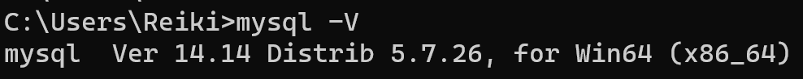
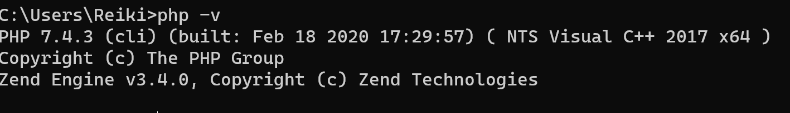

### [项目地址](https://lib.wyy.icu/)

### 1.本地运行环境配置

#### Mysql

> 安装   Mysql  **5.7** 以上版本 以及 系统环境变量配置
>
> 查看版本 cmd
>
> ```powershell
> mysql -V
> ```
>
> 

​       Laravel 根目录下的 ***.env***  文件

> ```php
> DB_CONNECTION=mysql
> DB_HOST=127.0.0.1
> DB_PORT=3306
> DB_DATABASE=library  # 自定义数据库名
> DB_USERNAME=root	 # Mysql 用户名
> DB_PASSWORD=root	 # Mysql 密码
> ```

#### PHP

> 安装 ***7.3*** 以上版本的  ***php*** 以及系统环境变量配置
>
> 查看版本 CMD
>
> ```powershell
> php -v
> ```
>
> 

### 2.运行数据迁移

Windows 终端进入 **laravel** 根目录

数据迁移

```powershell
php artisan migrate
```

### 3.执行数据填充

运行Seeder

生成 Composer 的自动加载器

```powershell
composer dump-autoload
```

填充数据(1000个座位、管理员账号)

```powershell
 php artisan db:seed 
```

### 4.启动本地服务

```powershell
php artisan serve 
```

最后QQ邮箱登录 测试

### 5.管理员账号

```sh
account: 1445919044
password: w1445919044
```

